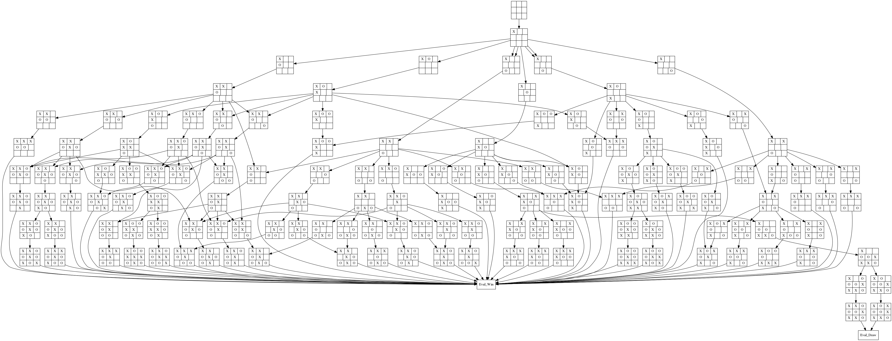

# Tick Tack Toe Solver

This is a program which solves Tick Tack Toe.

Tick Tack Toe is a good example of a minimal example for solving harder games, such as Checkers, Chess, or Poker, as it's a game of complete information, and computationally small, yet non-trivial enough to be interesting.

## Solver

The game is solved in each case, by considering that we have complete control over our actions, and may do any valid possibility. By working backwards at the terminals, we can mark terminals as and element from the set {Win, Draw, Lose}. We can then go up the graph, and then choice the move which is optimial. For nodes of Hero, we add those moves which are in the optmial, which for choides {Win}, {Lose}, is {Win}, however sometimes the optimal move could be {Win, Lose}, or even {Lose} in the game theortic sense of having a strategy given any state.

When marking Villian nodes, Villians node takes the union of all the possible moves. So for example, if the following nodes are {Win}, {Draw, Lose}, {Lose}, the node is marked {Win, Draw, Lose}.


```


                    {Win}
                    /   \
                   /     \
                {Win}   {Lose}

```
        

Here is the optimal solution for when Hero goes first.
 
  

Here is the optimal solution for when Hero goes second.

  

